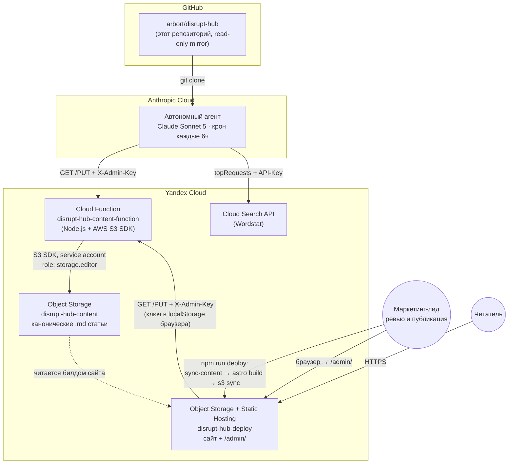
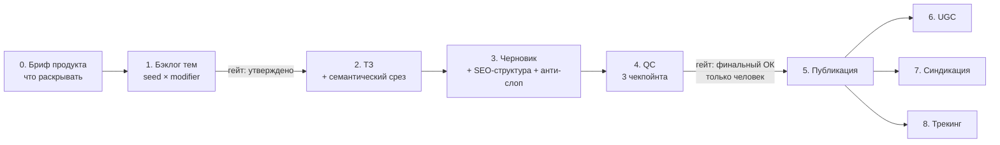

# Disrupt-Hub

**Контентный движок и автономный ИИ-редактор для линейки AI-продуктов Дизрапта** — методология, живой пайплайн из 8 стадий, движок публикации на Yandex Cloud и агент (Claude), который сам пишет и публикует черновики статей по расписанию.


disrupt-hub.ru — это библиотека E2E-кейсов о применении девяти AI-продуктов Дизрапта в реальных рабочих и жизненных сценариях: реальные скрины, настройки, промпты, а не пересказ фич. Отличие от библиотек промптов вроде ПромптХаба Алисы — здесь не промпты вокруг одной LLM, а кейсы вокруг девяти разных инструментов.

Этот репозиторий — единственный источник правды по тому, **как** этот контент производится: от методологии до кода сайта, админки и облачного агента, который пишет статьи сам.

---

## Оглавление

- [Что здесь есть](#что-здесь-есть)
- [Портфель продуктов](#портфель-продуктов)
- [Архитектура](#архитектура)
- [Пайплайн: восемь стадий](#пайплайн-восемь-стадий)
- [Стандарт качества: SEO + анти-слоп](#стандарт-качества-seo--анти-слоп)
- [Семантика и Wordstat](#семантика-и-wordstat)
- [Автономный агент](#автономный-агент)
- [Структура репозитория](#структура-репозитория)
- [Локальный запуск и деплой](#локальный-запуск-и-деплой)
- [Секреты и безопасность](#секреты-и-безопасность)
- [Как устроено управление контентом](#как-устроено-управление-контентом)
- [Что сюда не входит](#что-сюда-не-входит)

---

## Что здесь есть

Это не просто набор markdown-файлов с методологией — здесь лежит **весь работающий стек**:

| Слой | Что это | Где |
|---|---|---|
| Методология | 8-стадийный пайплайн, жёсткие правила, стандарт письма | `hub/HUB.md` |
| Фактура продуктов | что раскрывать в статьях, продуктовые запреты | `hub/briefing/`, `products/*/PRODUCT.md` |
| Бэклог и семантика | темы статей, статусы, поисковые фразы | `hub/topics/`, `hub/admin/scripts/topic-phrases.tsv` |
| Публичный сайт | Astro, статическая генерация, читает статьи напрямую из markdown | `hub/site/` |
| Админ-панель | редактор статей, SEO-чеклист, дашборд бэклога | `hub/admin/web/` |
| Backend админки | Yandex Cloud Function, CRUD поверх Object Storage | `hub/admin/function/` |
| Скрипты публикации и семантики | синк с бакетом, снятие частотности по Wordstat | `hub/admin/scripts/` |
| Автономный писатель | не код в этом репо — конфигурация облачного агента, который **клонирует именно этот репозиторий** и пишет статьи по расписанию | описан ниже |

---

## Портфель продуктов

Девять независимых AI-продуктов, каждый — отдельная экономика, отдельная аудитория, отдельный бренд (см. «Бренд-рамка» в `DISRUPT.md`).

| Продукт | Что делает | Платформа | Статус фактуры |
|---|---|---|---|
| **Мультитул** (`tool`) | ИИ-ассистент для работы и учёбы прямо на компьютере: презентации, таблицы, документы, исследования | Desktop: macOS arm64 · Windows x64 · Linux deb | полная |
| **Тайп** (`type`) | Локальная диктовка: горячая клавиша → речь → текст в любом приложении, без интернета | Desktop: Windows · macOS arm64 | полная |
| **ИИ-Консьерж** (`concierge`) | Сам звонит по телефону и договаривается — бронь, запись, план поездки | Telegram-бот | полная |
| **Айва** (`aiwa`) | Проактивный ИИ-консультант по здоровью, питанию, тренировкам и циклу | Telegram-бот + mini app | полная |
| **Гочи** (`gochi`) | ИИ-питомец в телефоне: уход, гардероб, путешествия в тамагочи-формате | Android (iOS скоро) | стаб — только с лендинга |
| **Narra** (`narra`) | Интерактивная читалка: озвучивает книгу, «оживляет» героев для чата | iOS (TestFlight) · Android | стаб |
| **Memento** (`memento`) | Записывает встречи, расшифровывает и собирает итоги с поиском по архиву | macOS | стаб |
| **Короче** (`korche`) | ИИ-агрегатор новостей: своя лента, фактчек, смена стиля пересказа | Web (закрытая бета) | стаб |
| **Disrupt Radar** (`radar`) | Публичная витрина research-конвейера Дизрапта — живая лента находок по растущим стартапам | Web | стаб |

> «Стаб» — фактура собрана только с публичного лендинга продукта, без брифа от продуктовой команды; не использовать для рекламных текстов без проверки, для контентных статей — достаточно как отправная точка (см. каждый `PRODUCT.md`).

Десятый продукт линейки, **Ника**, в контентный хаб не входит — на портфельной витрине Дизрапта её нет, а не потому, что забыли (решение зафиксировано в `hub/HUB.md`).

---

## Архитектура

Система живёт на стыке трёх независимых платформ: **GitHub** (этот репозиторий — контекст), **Anthropic Cloud** (автономный писатель) и **Yandex Cloud** (хостинг, хранилище, API семантики).



### Компоненты Yandex Cloud

| Ресурс | Роль | Кто им пользуется |
|---|---|---|
| **Object Storage: `disrupt-hub-deploy`** | Статический хостинг публичного сайта + админки (`/admin/`), публичный доступ per-object ACL | билд сайта (`npm run deploy`), браузер читателя |
| **Object Storage: `disrupt-hub-content`** | Канонический источник статей (`.md` с фронтматтером) — единственная точка правды, независимая от `articles/` в рабочем дереве | Cloud Function (запись), билд сайта (чтение при синке) |
| **Cloud Function `disrupt-hub-content-function`** | Публичная (unauthenticated invoke), CRUD-прокси перед бакетом контента. `OPTIONS` отвечает без проверки (иначе браузерный CORS-preflight не проходит), `GET/PUT/DELETE` сверяют заголовок `X-Admin-Key` с секретом в переменных окружения | автономный агент, админ-панель |
| **Service account `disrupt-hub-content-sa`** | `storage.editor`, ограничен ровно одним бакетом (`disrupt-hub-content`) | доступ функции к бакету, статический access key в переменных окружения функции |
| **Service account `disrupt-hub-deploy`** | `storage.admin` на весь каталог | используется только локально с машины разработчика через `aws-cli` профиль, в проде не участвует |
| **Cloud Search API (Wordstat)** | Частотность и семантические кластеры запросов | скрипт приоритизации бэклога + семантический срез перед ТЗ (см. ниже) |

Хранилище Yandex Object Storage S3-совместимо — весь код (`admin/function`, `admin/scripts`, `hub/site`) работает через официальный `@aws-sdk/client-s3` / `aws-cli`, без Yandex-специфичного SDK.

---

## Пайплайн: восемь стадий



Полная методология каждой стадии — `hub/HUB.md`. Ключевые инварианты пайплайна:

- **Без реального продуктового артефакта — не публикуем.** Каждая статья несёт реальный скрин, настройку или промпт — это одновременно и требование к качеству (E-E-A-T), и защита от «scaled content abuse» в терминологии Google.
- **Тема утверждается человеком до ТЗ.** Ни агент, ни автоматизация не переводят тему из «идея» в работу сами.
- **Финальная публикация — только человек.** Ни автономный агент, ни один скрипт в этом репозитории физически не может выставить статье статус `published`.
- **Продуктовые факты — только из `PRODUCT.md`/`briefing/*`.** Ничего не выдумывается сверх зафиксированной фактуры.

---

## Стандарт качества: SEO + анти-слоп

Свод внешних SEO-практик (Google Search Central, Ahrefs, Backlinko, TexTerra) и публичных методик де-слопификации AI-текста (Wikipedia: Signs of AI Writing, русскоязычная «Признаки сгенерированности текста», `slop-gate`), адаптированный под контент хаба. Полный текст — `hub/HUB.md`, раздел «Стандарт письма: SEO-структура + анти-слоп».

Кратко:

- **Плотность ключевых слов не считается и не оптимизируется** — устаревшая практика (Google, официально опровергнуто с 2011 года). Вместо неё — точное размещение фразы в заголовке/интро и естественное покрытие семантического кластера.
- **Длина статьи не фиксируется числом слов** — решает глубина покрытия темы, искусственное растягивание запрещено.
- **Анти-слоп чек-лист** режет канцелярит, дидактическое хеджирование («важно отметить», «стоит учесть»), инфляцию значимости и ложную агентность («играет ключевую роль»), диалоговые утечки модели («безусловно», «надеюсь, это было полезно») — с явным **правилом анти-сверхкоррекции**: одно найденное слово не повод портить предложение или резать реальный факт.
- Мета-теги, заголовочная структура, внутренняя перелинковка — конкретные лимиты и правила, не общие советы.

---

## Семантика и Wordstat

Частотность и семантические кластеры снимаются через Yandex Cloud Search API (Wordstat), не вручную:

1. `hub/admin/scripts/topic-phrases.tsv` — вручную подобранная короткая поисковая фраза на каждую тему бэклога (заголовки бэклога — блог-формулировки, не то, что реально вбивают в поиск).
2. `hub/admin/scripts/apply-topic-frequency.py` — прогоняет фразы через Wordstat, пишет широкую частотность и топ-10 похожих запросов прямо в `hub/topics/*-backlog.md`, идемпотентно (не перезаписывает уже заполненные ячейки).
3. Перед написанием ТЗ (Stage 2) из полученных «похожих запросов» вручную отбираются 5–8 фраз, реально релевантных теме — с явным исключением шума по общему слову, не по смыслу (пример из практики: «калории по фото» подтягивает «бпла фото» — совпадение по слову «фото», к теме отношения не имеет).
4. Приоритет темы в бэклоге — прозрачная формула `Частотность × вес интента × вес продуктового соответствия`, все компоненты видны как отдельные колонки в админ-дашборде, финальное решение всегда за человеком.

---

## Автономный агент

Помимо интерактивной работы с этим репозиторием, отдельный **облачный агент на Claude Sonnet 5** пишет черновики статей полностью самостоятельно, по расписанию, без участия человека в моменте запуска.

| Параметр | Значение |
|---|---|
| Расписание | каждые 6 часов (cron) |
| Контекст | клонирует **именно этот репозиторий** — read-only срез, не полное рабочее дерево |
| Лимит очереди | не более 3 статей одновременно в статусах `draft`/`qc` — темп ограничен пропускной способностью ревью, не скоростью генерации |
| Дедупликация | по полю `topicId`, не по совпадению заголовка |
| Приоритет тем | сначала Мультитул, затем Тайп, затем остальные семь — см. «Приоритизация производства» в `hub/HUB.md` |
| Что может | писать `draft`/`qc`, запрашивать Wordstat, читать бэклог и продуктовую фактуру |
| Чего не может **никогда** | выставить статус `published`; писать по неутверждённой теме; выдумывать факты сверх `PRODUCT.md`; публиковать без маркера реального скриншота |
| Самопроверка перед сдачей | SEO-структура, анти-слоп чек-лист, соответствие продуктовым запретам — по тем же стандартам, что и у человека-редактора |

Агент публикует черновик со статусом `qc` через тот же Cloud Function API, что и админ-панель — никакого отдельного привилегированного пути записи в систему нет.

---

## Структура репозитория

```
.
├── README.md                          — этот файл
├── DISRUPT.md                         — программный контекст: воронка гипотез, KPI, бюджетная рамка
│
├── shared/
│   └── PRODUCTS.md                    — бренд- и креативная дифференциация продуктов
│
├── products/
│   └── <slug>/PRODUCT.md              — фактура и запреты по каждому из 9 продуктов
│
└── hub/
    ├── HUB.md                         — ЯДРО РЕПОЗИТОРИЯ: методология, 8 стадий, стандарт письма, жёсткие правила
    ├── platform-technical-seo.md      — технический SEO-чеклист (canonical, sitemap, микроразметка)
    │
    ├── briefing/
    │   └── <slug>-hub-briefing.md     — что раскрывать по продукту в статьях, что нет (×9)
    │
    ├── topics/
    │   └── <slug>-backlog.md          — бэклог тем: статус, интент, частотность, балл приоритета (×9)
    │
    ├── site/                          — ПУБЛИЧНЫЙ САЙТ (Astro, статическая генерация)
    │   ├── astro.config.mjs
    │   ├── package.json
    │   └── src/
    │       ├── content.config.ts      — content collection: читает статьи напрямую, без дублирования
    │       ├── data/products.ts       — карточки продуктов для фильтра сайта
    │       ├── components/            — ArticleCard, ProductCard, Header, Footer
    │       ├── layouts/BaseLayout.astro
    │       ├── pages/                 — index, [product]/index, [product]/[slug], submit, 404
    │       └── styles/                — design-токены (deslop)
    │
    └── admin/                         — АДМИН-ПАНЕЛЬ И BACKEND
        ├── function/                  — Yandex Cloud Function (Node.js)
        │   ├── index.js               — CRUD поверх Object Storage, X-Admin-Key auth
        │   └── .env.example           — имена переменных окружения (без значений)
        ├── web/                       — статический фронтенд админки (vanilla JS)
        │   ├── index.html · app.js · styles/
        │   └── data/                  — снапшоты реестра тем и частотности (генерируются скриптами)
        └── scripts/                   — локальные инструменты обслуживания
            ├── publish.mjs            — публикация локального файла статьи в бакет
            ├── sync-topics.mjs        — бэклоги → JSON для дашборда админки
            ├── apply-topic-frequency.py — Wordstat → бэклоги
            ├── topic-phrases.tsv      — topicId → поисковая фраза
            └── topic-product-fit.json — topicId → якорная/периферийная тема
```

Рабочие черновики (`hub/articles/`, стадии idea→qc) и их зеркало из бакета (`hub/articles-published/`) в этот репозиторий сознательно **не входят** — они живут в основном рабочем дереве и в самом Object Storage, не дублируются здесь.

---

## Локальный запуск и деплой

```bash
# Сайт — локальная разработка
cd hub/site
npm install
npm run dev              # http://localhost:4321

# Сайт — деплой в прод (синк опубликованных статей → сборка → загрузка в бакет)
npm run deploy

# Админ-панель — деплой статики
npm run deploy:admin

# Cloud Function — редеплой только вручную через консоль Yandex Cloud
# (см. hub/admin/function/.env.example — какие переменные окружения нужны функции)
```

Деплой требует локально настроенного `aws-cli` с профилем `yandex` (Yandex Object Storage S3-совместим) — учётные данные этого профиля **не хранятся в репозитории** ни в каком виде.

---

## Секреты и безопасность

Ни один секрет — ключ доступа, `ADMIN_SECRET`, токен — **никогда не коммитится в этот репозиторий**, независимо от того, кто имеет к нему доступ на момент коммита. Причина простая и не зависит от размера аудитории: git-историю нельзя тихо стереть переписыванием одного файла, а право доступа к репозиторию может измениться уже после коммита.

- Весь код читает секреты из переменных окружения (`process.env.*`) — ни одного хардкода нет ни в `admin/function/`, ни в `admin/web/`, ни в скриптах.
- `.env.example` / `.env.local.example` в репозитории — это шаблоны с **именами** переменных, без значений.
- `.gitignore` в корне и в `hub/site/` блокирует `.env`, `.env.*` (кроме `*.example`), `node_modules/`, `dist/`, `.astro/`.
- Ключ администратора в веб-панели вводится оператором в форму и живёт только в `localStorage` браузера — не зашит в исходный код `app.js`.
- Реальные значения секретов передаются между сотрудниками вне git — защищённым каналом (менеджер паролей / закрытая заметка), не через issue, PR или коммит.

---

## Как устроено управление контентом

- **Гейт «идея → утверждено»** проходит либо правкой `hub/topics/*-backlog.md` в git, либо живым одобрением прямо из админ-дашборда (не требует правки файла) — приоритет: написанная статья > живое одобрение > статус из git-файла.
- **QC — три чекпойнта**: соответствие ТЗ и стандарту письма → продуктовые факты и бренд-правила → пост-паблиш техничка (мета/H1 живые на сайте, ссылки резолвятся).
- **Синдикация** (Dzen, VC, Habr) — только после индексации оригинала, с адаптацией под тон площадки, никогда дословным копипастом.
- **UGC** — критерии модерации и меню стимулов описаны в методологии; форма приёма статей от пользователей — зона продуктовой команды, не контентного движка.

---

## Что сюда не входит

Этот репозиторий — полный стек **контентного движка**, но не вся инфраструктура Дизрапта целиком:

- Рекламные креативы, баннер-кит, медиапланы, отчёты по перформансу, брендбуки продуктов, данные кампаний, бюджетные xlsx — зона отдельных рабочих процессов, не имеет отношения к написанию и публикации статей.
- Долгосрочная техническая эксплуатация (домен `disrupt-hub.ru`, продление сертификатов, мониторинг аптайма бакетов) — открытый организационный вопрос, зафиксированный в `hub/HUB.md`.
- Форма приёма UGC-статей от внешних пользователей — сейчас просто ссылка на `t.me/disrupt_team`, отдельная архитектура не спроектирована.
